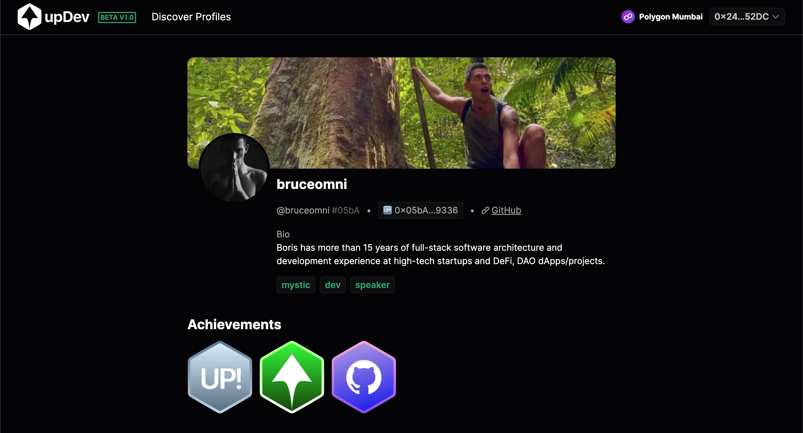

<div align="center">
  
  <h3>Your universal dev profile – mint all your merits on-chain.</h3><h4>powered by Lukso & Chainlink</h4>
</div>

<div align="center">
  <a href="https://www.youtube.com/watch?v=whP8iiYZW6Y">YouTube Video</a>&nbsp;&nbsp;&nbsp;|&nbsp;&nbsp;&nbsp;<a href="https://updev-nextjs.vercel.app/">Live Site</a>
</div>

<br />

This repo contains the code for a project submission for BuildUP #2 Hackathon on [buidlbox.io](https://app.buidlbox.io/lukso/build-up-2) which ended November 27th 2023.

upDev is a multi-chain dApp that allows you to mint your web2/web3 accounts like GitHub, Twitter or Buidlbox (thanks to Chainlink Functions) as soulbound NFT 2.0 (Lukso's LSP8) to create Universal Dev Profile, that will contain all your merits on-chain – somewhere where they can never be lost.

It leverages [Lukso Network](https://lukso.network/), [Univeral Profiles browser extension](https://chromewebstore.google.com/detail/universal-profiles/abpickdkkbnbcoepogfhkhennhfhehfn), [Polygon Mumbai](https://mumbai.polygonscan.com/) and [Chainlink Functions](https://docs.chain.link/chainlink-functions).
<br />

<div></div>
<div></div>
<br />

## Features

✅ Users can connect various web2/web3 accounts related to their developer activities to generate ownership-proofs which exist on-chain to verify they own their accounts using [Chainlink Functions]() and earn achievements related to their activity.

✅ Chainlink Functions are currently not supported on Lukso networks, so users can connect with both their Polygon Mumbai wallet and their Universal Profile browser extension to deploy their Universal Profile onto Polygon Mumbai where Chainlink Functions are supported.

✅ Profile page where users can connect their web2/web3 accounts and see all information associated with them, as well as users original Lukso Mainnet Universal Profiles metadata.

✅ Discover Profiles page that lists a directory of all upDev developers.

[TODO] deploy UP on Polygon Mumbai AT THE SAME ADDRESS using LSP23<br />
[TODO] implement LSP24 to link UPs on different chains

## Integrations

<b>LIVE</b><br />
✅ [GitHub](https://github.com/) <br />
✅ [Buidlguidl](https://buidlguidl.com/) <br />

<b>Coming Soon</b><br />
🌀 [buidlbox](https://app.buidlbox.io/) <br />
🌀 [Gitcoin Passport](https://passport.gitcoin.co/) <br />
🌀 [LinkedIn](https://www.linkedin.com/) <br />
🌀 [X / Twitter](https://twitter.com/) <br />

## Run Frontend

first git clone this repo:

```git clone https://github.com/tantodefi/updev.git```

install dependencies:

```yarn install```

run the app

```yarn start```

### Technologies Used

- [scaffold-eth-2](https://scaffoldeth.io/)
- [nextjs](https://nextjs.org/)
- [vercel](vercel.com)
- [Lukso LSPs](https://github.com/lukso-network/lsp-smart-contracts)
