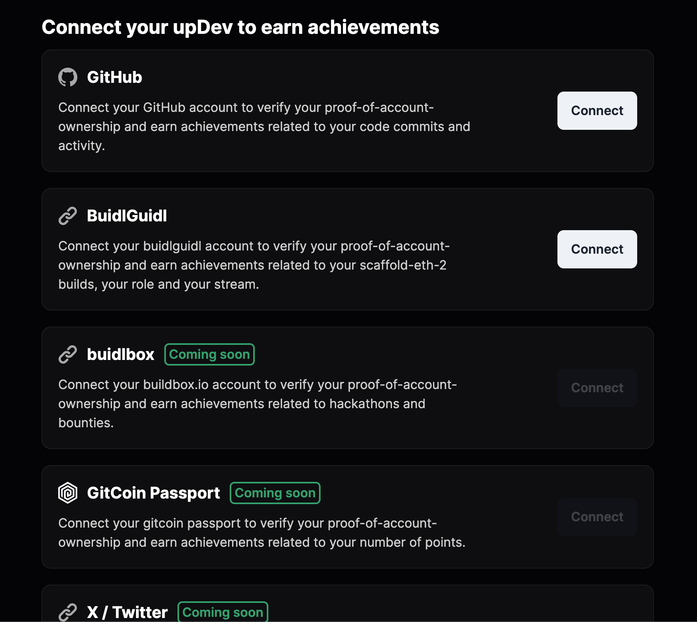

  <picture>
    <source media="(prefers-color-scheme: dark)" srcset="logo.svg">
    <source media="(prefers-color-scheme: light)" srcset="logo-black.svg">
    
  </picture>
  <h3>Your universal dev profile – mint all your merits on-chain.</h3><h4>powered by Lukso & Chainlink</h4>

  <a href="https://www.youtube.com/watch?v=whP8iiYZW6Y">YouTube Video</a>&nbsp;&nbsp;&nbsp;|&nbsp;&nbsp;&nbsp;<a href="https://updev-v1.vercel.app/">Live Site</a>

 

###### This repo contains the code for a project submission for BuildUP #2 Hackathon on [buidlbox.io](https://app.buidlbox.io/lukso/build-up-2) which ended November 27th 2023 and [Chainlink Constellations Hackathon](https://devpost.com/software/updev) which ended December 10th 2023.

Imagine having a universal decentralized identity/profile that will connect all your web2/web3 accounts and keep any valuable public data from these accounts forever.

upDev is a multi-chain dApp that allows you to mint your web2/web3 accounts like GitHub, Twitter or Buidlbox (thanks to Chainlink Functions) as soulbound NFT 2.0 ([Lukso's LSP8](https://docs.lukso.tech/standards/tokens/LSP8-Identifiable-Digital-Asset/)) to create Universal Dev Profile, that will contain all your merits on-chain – somewhere where they can never be lost.

It leverages [Lukso Network](https://lukso.network/), [Univeral Profiles browser extension](https://chromewebstore.google.com/detail/universal-profiles/abpickdkkbnbcoepogfhkhennhfhehfn), [Polygon Mumbai](https://mumbai.polygonscan.com/) and [Chainlink Functions](https://docs.chain.link/chainlink-functions)
 

 

## Features
✅ Users can connect various web2/web3 accounts related to their developer activities to generate ownership-proofs which exist on-chain to verify they own their accounts using Chainlink Functions and earn achievements related to their activity.

✅ Chainlink Functions are currently not supported on [Lukso Network](https://lukso.network), so users can connect with both their Polygon Mumbai wallet and their Universal Profile browser extension to deploy their [Universal Profile](https://https://universalprofile.cloud/) onto Polygon Mumbai where Chainlink Functions are available now!

✅ [LSP24](https://github.com/lukso-network/LIPs/issues/212) (experimental) verification of user's Universal Profiles.

✅ Profile page where users can connect their web2/web3 accounts and see all information associated with them, as well as users original Lukso Mainnet Universal Profiles metadata.

✅ Discover Profiles page that lists a directory of all upDev developers.

## TODOs
🌀 Deploy UP on Polygon Mumbai AT THE SAME ADDRESS using [LSP23](https://docs.lukso.tech/standards/generic-standards/lsp23-linked-contracts-factory)

🌀 [DONE] Retrieve on-chain and display on the dApp following GitHub account stats: date created, number of followers, contributions in the last year and following BuidlGuidl account stats: date created, role, functions, number of builds

🌀 Allow to mint a Repo NFT (with number of stars & other stats) shared by repository contributors proportionally to a number of their contributions

🌀 Allow bounty hunters to share their API tokens in exchange for a fee in order to give access to paid APIs like Twitter/X API

🌀 Support GitCoin Passport, Buidlbox, Twitter/X & other providers

## Verified Smart Contracts

upDevAccountOwnership (LSP8 – NFT 2.0 Soulbound Collection)
https://mumbai.polygonscan.com/address/0xe015eB341264Ac609761f31Beb1C55BE8b6C69b0

upDevFunctionsConsumer (Chainlink Functions Consumer & Minter)
https://mumbai.polygonscan.com/address/0x64B78FCB73500EB7Ce387b06bBa814BeaA7e2F9b

upRegistry (upDev Profiles Registry) 
https://mumbai.polygonscan.com/address/0xB665840C5929d140494708A619dA834d944d8CBC

## Figma Designs

https://www.figma.com/file/LVYEWZriiuiIdxoSq9mJ5g/upDev-v1.0?type=design&node-id=2102-385&mode=design&t=GnSTXkxvO6Wid6e1-0

## Run Frontend

first git clone this repo:

`git clone https://github.com/tantodefi/updev.git`

install dependencies:

`yarn install`

run the app

`yarn start`

### Technologies Used

- [scaffold-eth-2](https://scaffoldeth.io/)
- [nextjs](https://nextjs.org/)
- [vercel](vercel.com)
- [Lukso LSPs](https://github.com/lukso-network/lsp-smart-contracts)
