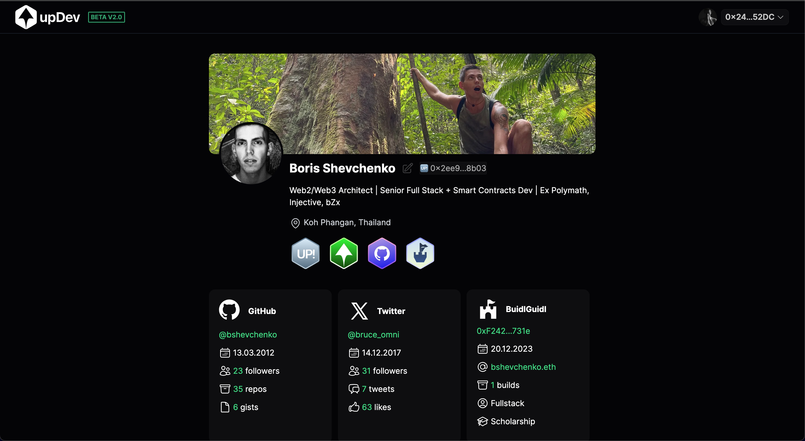

  <picture>
    <source media="(prefers-color-scheme: dark)" srcset="assets/logo.svg">
    <source media="(prefers-color-scheme: light)" srcset="assets/logo-black.svg">
    
  </picture>
  <h2>Your pass to new opportunities!</h2>

#### 🏅 Winner of BuildUP #2 Lukso Hackathon

<!-- 

  <a href="https://www.youtube.com/watch?v=whP8iiYZW6Y">TODO YouTube Video</a>&nbsp;&nbsp;&nbsp;|&nbsp;&nbsp;&nbsp;<a href="https://updev-v1.vercel.app/">TODO Live Site</a>  

 -->

Powered by: <a class="c0" href="https://docs.lukso.tech/learn/introduction">Lukso Network</a>, <a class="c0" href="https://docs.lukso.tech/standards/universal-profile/introduction">Universal Profiles</a>&nbsp;(on <a class="c0" href="https://erc725alliance.org/">ERC725</a>), <a class="c0" href="https://ethereum.org/">Ethereum</a>, <a class="c0" href="https://docs.chain.link/chainlink-functions">Chainlink Functions</a>, <a class="c0" href="https://www.pinata.cloud">Pinata IPFS</a>, <a class="c0" href="https://github.com/scaffold-eth/scaffold-eth-2">Scaffold-ETH 2</a>, <a class="c0" href="https://next-auth.js.org/">next-auth</a>, <a class="c0" href="https://moralis.io/">Moralis</a>, <a class="c0" href="https://www.mongodb.com/">MongoDB</a>, <a class="c0" href="https://vercel.com/">Vercel</a>

Inspired by: <a class="c0" href="http://linktr.ee">linktr.ee</a>, <a class="c0" href="https://linkedin.com/">LinkedIn</a>, <a class="c0" href="https://passport.gitcoin.co/">Gitcoin Passport</a>, <a class="c0" href="https://github.com/">GitHub</a>, <a class="c0" href="https://tea.xyz/">tea.xyz</a>, <a class="c0" href="https://poap.xyz/">poap.xyz</a>

<h3 class="c3">Introducing upDev &ndash; the revolutionary creative decentralized social network, driven by the innovative Holistic Identity Protocol (sybil-resistant self-owned Web2.5 identities).

</h3>

<h3 class="c5 c2">Creative</h3>

At its core, upDev is designed to champion creativity. Its primary mission is to empower creators, builders, and visionaries, fostering an environment where they can recognize and celebrate each other&#39;s contributions to cultivate fruitful collaborations.

<h3 class="c5 c2">Decentralized</h3>

Decentralization frees transactions from the need to rely on central authorities like banks or corporations. This approach ensures transparency, self-ownership, and <a class="c0" href="https://balajis.com/p/the-billion-user-table">maximized network effects</a>.

<h3 class="c3">Sybil-resistant</h3>

A Sybil attack occurs when a malicious actor creates numerous fake identities to manipulate a network. upDev combats this by introducing the innovative Holistic Identity Protocol.

<h3 class="c3">Holistic</h3>

Non-Fungible Tokens (NFTs), serving as identities of ownership over various properties, including intellectual ones, are central to upDev. Through cryptography, OAuth protocol and a decentralized oracle network, upDev (unlike linktr.ee & Gitcoin Passport) trustlessly links & unifies your existing Web2 and Web3 identities (such as emails, websites, social accounts like Twitter or GitHub, AI agencies, crypto-wallets, etc.) and their data by minting them as soulbound NFTs owned by a single super-identity (<a class="c0" href="https://docs.lukso.tech/standards/universal-profile/introduction">Universal Profile</a>). This super-identity acts as a comprehensive & trustless resume for individuals or companies.

<h3 class="c3">Self-owned</h3>

Leveraging blockchain technology, upDev ensures that individuals or companies have exclusive ownership of their super-identity, inherently protecting their content and achievements from deletion, restrictions, censorship, and other risks associated with centralized Web2 platforms.

<h3 class="c3">Web2.5</h3>

upDev embodies the synthesis of Web2 and Web3 technologies, combining the convenience of centralized systems with the empowerment of decentralized ones. It seamlessly integrates the best of both worlds, offering users a unified digital experience where autonomy, data ownership, and collaboration thrive without limits.

<h3 class="c3">Identities</h3>

upDev allows anyone to automatically mint, share, and integrate new identities &ndash; Pass NFTs, which qualitatively represent public relations (PR) between individuals or legal entities within the upDev ecosystem. Just as a letter from an influential individual attesting that you&#39;re an exceptional talent can guarantee your application for a US visa, a Pass NFT can unlock new opportunities for you beyond imagination!

<h2 class="c3">Use Cases</h2>

<h3 class="c3">Proof of Attendance</h3>

Pass NFT commemorates participation in events, such as conferences, workshops, or courses, with a digital token signifying the attendee&#39;s engagement and contribution. Unlike the existing Proof of Attendance Protocol (<a class="c0" href="https://poap.xyz/">poap.xyz</a>), upDev does not require any curatorship due to its sybil-resistance.

For most companies, their main online identity is their website domain name. Once a company mints (proves ownership of) its website on upDev, it can immediately proceed to mint Pass NFTs for everyone. And by minting social accounts like X (Twitter), Discord, GitHub, etc., a company can further enhance its profile&rsquo;s Sybil resistance and resume.

<h3 class="c3">Proof of Relationship</h3>

Pass NFT certifies significant memberships, friendships, professional relationships, mentorships, partnerships, or endorsements, enhancing trust within the network and differentiating the quality of each relationship, unlike LinkedIn where nobody knows what contact between two people means or where endorsements from people with different qualifications are considered equal.

<h3 class="c3">Proof of Competence</h3>

Pass NFT acts as digital diplomas or certificates, representing trust in an individual&rsquo;s skills and knowledge, and weighted to reflect the level of achievement or endorsement. 

<h2 class="c3">Why is upDev powered by <a class="c0" href="http://lukso.network">LUKSO</a>&nbsp;& <a class="c0" href="https://docs.lukso.tech/standards/universal-profile/introduction">Universal Profiles</a>?</h2>

Building an identity on top of keys is almost impossible because keys are likely to be leaked or lost forever. Holding assets and building a reputation on these keys makes it worse. A better representation of identity would be with blockchain-based accounts.

The story of LUKSO started with ERC725, a standard proposed by Fabian Vogelsteller for blockchain-based identity. ERC725 allows for self-sovereign identity. Over the years we saw the negative effects of having a centralized identity with damaging leaks and unfair selling of user data and identity. An open, portable standard for identities enables decentralized reputation, governance, and more. Users can take their identity across different dApps and platforms that support this standard.

LUKSO is intended for creative economies, where identities play a key role. LUKSO allows brands, creatives, and developers to dictate the distribution of wealth and influence from lifestyle activities. They can do so by having Universal Profiles (UPs), creating Digital Identities and Certificates, and by building Tokenized Communities.

LSPs (LUKSO Standard Proposals) are the building blocks of LUKSO. They are used to build blockchain-based applications that offer an enhanced user experience, and allow for more flexibility and interaction.

LSPs introduce new concepts like Universal Profiles, Digital Assets & NFT 2.0, and Vaults.

By integrating different LSPs in unique ways, LUKSO solves fundamental blockchain problems:
<ol class="c18 lst-kix_u4237hmzc949-0 start" start="1"><li class="c7 c13 li-bullet-0">&#128275; Upgradeable security: UPs can be owned by an EOA or a custom contract such as a multisig. Therefore, users can have multiple devices and applications controlling their account, each of them with different permissions. Users can even have social recovery, such that you grant certain permissions to their account to their friends and family.</li><li class="c7 c13 li-bullet-0">&#128105;&zwj;&#127908; On-chain profile: users can build their profiles onchain, adding images, tags, descriptions and links to their accounts to shape their online persona.</li><li class="c7 c13 li-bullet-0">&#128221; Updatable and flexible metadata: metadata can be updated, enabling dynamic NFTs that can change certain properties over time, while other properties remain immutable.</li><li class="c7 c13 li-bullet-0">&#128171; Extend your account over time: users can extend their account over time seamlessly, with no need to redeploy the associated smart contract.</li><li class="c7 c13 li-bullet-0">&#9981;&#65039; Gasless experience: UPs support Transaction Relay Services that cover the gas for user&#39;s transactions. Users won&#39;t have the burden of getting coins in order to use your application.</li></ol>

<h2 class="c19" id="h.193o3zog99y7">Why is upDev powered by Chainlink, Ethereum & Moralis?</h2>
Chainlink is the Web3 Industry-Standard to connect the world (web2) to blockchains.

For example, a GitHub pull request merged into an impactful project repository can be considered as a merit of a certain value. That value can be calculated out of an:
<ol class="c18 lst-kix_jl10554wma7x-0 start" start="1"><li class="c7 c13 li-bullet-0">Impact of a project. For instance, that can simply be a number of project package downloads.</li><li class="c7 c13 li-bullet-0">Impact of a pull request on that project, that can for instance be represented as a standard pull-request label like &quot;Critical Bug&quot;, &quot;High Bug&quot;, &quot;Medium Bug&quot;, etc.</li></ol>
Thanks to Chainlink, upDev smart contracts can access all that data from GitHub GraphQL API to mint & update dynamic merits NFTs 2.0. Though data itself is stored on IPFS (due to cost efficiency, scalability and flexibility) and replicated into MongoDB (via Moralis) for easy access.

As of now, Chainlink Functions and Moralis don&#39;t have support for Lukso Network. That&rsquo;s a primary reason why upDev is deployed on two chains at the same time, but that doesn&rsquo;t affect User Experience at all, since upDev dApp has its own gas relayer besides just Lukso&rsquo;s one. With these gas relayers users don&rsquo;t have to worry about any gas fees or even about the network that they are currently connected to.

The secondary reason for this is to demonstrate that Lukso&rsquo;s Universal Profiles are actually blockchain-agnostic and can be deployed to any EVM-compatible network at the same address (thanks to <a class="c0" href="https://docs.lukso.tech/standards/generic-standards/lsp23-linked-contracts-factory/">LSP23</a>) just like classic EOAs work. Though browser <a class="c0" href="https://chromewebstore.google.com/detail/universal-profiles/abpickdkkbnbcoepogfhkhennhfhehfn?hl%3Den">Universal Profiles Extension</a>&nbsp;is yet to support different chains, that&rsquo;s why upDev currently doesn&rsquo;t implement it.
<h2 class="c19" id="h.lggqz7kljxa3">Supported Providers</h2><ul class="c18 lst-kix_ahjrpwmlk0ki-0 start"><li class="c3 c13 li-bullet-0">X (Twitter)</li><li class="c3 c13 li-bullet-0">GitHub</li><li class="c3 c13 li-bullet-0">Google</li><li class="c3 c13 li-bullet-0">Discord</li>

<li class="c3 c13 li-bullet-0"><a class="c0" href="https://buidlguidl.com/">BuidlGuidl</a></li>

<li class="c3 c13 li-bullet-0">Website (HTTPs)</li><li class="c3 c13 li-bullet-0">Telegram (coming soon)</li>

<li class="c3 c13 li-bullet-0">LinkedIn (coming soon)</li>

</ul>

upDev implements <a class="c0" href="https://next-auth.js.org/">next-auth</a>&nbsp;that supports ~65 different providers, including ones like Apple, Coinbase, Strava, Medium and much more, which can easily be activated in upDev. But actually any API (including AI) can be implemented. For instance, you could mint your website Google Analytics to showcase your hosts & hits in a trustless manner!

## Run Frontend

first git clone this repo:

`git clone https://github.com/bshevchenko/updev.git`

install dependencies:

`yarn install`

run the app

`yarn start`
